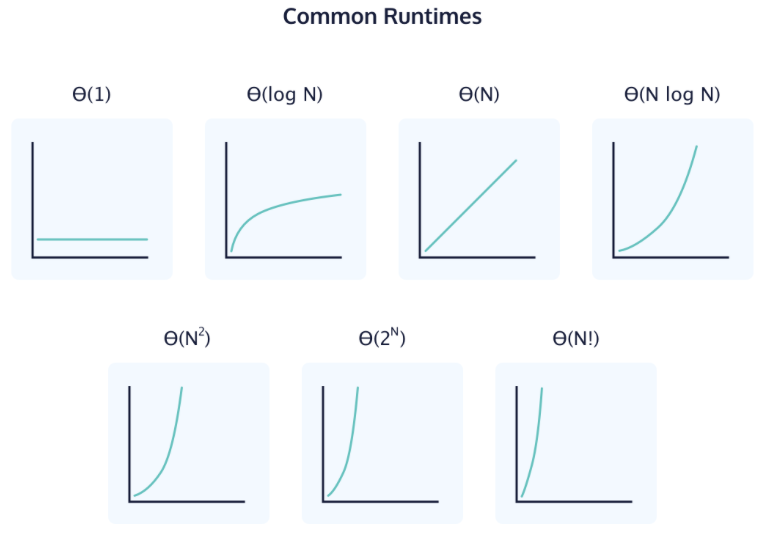

# Discussion 2

[visualising data structures and algorithms through animation - VisuAlgo](https://visualgo.net/en)

## Agenda

* Asymptotic notation
  + definition
  + Algorithmic Common Runtimes
  + Analyzing Runtime examples
  + a little taste of formal proof
* homework 1
  + data structures to implement
  + the `optional` type
  + Google Test
---

# Asymptotic notation

---

## Definitions

* $T(n)$: run time of the function for $n \in \mathbb{N}$ denote the size of input
* $O$: asymptotic **upper** bound
* $\Omega$ (Omega): asymptotic **lower** bound
* $ \Theta$ (Theta): asymptotic **tight** bound

---

### Algorithmic Common Runtimes

The common algorithmic runtimes from fastest to slowest: 

- constant: Θ(1)
  - Accessing an element of an array by index.
  - Basic arithmetic operations (e.g., addition, subtraction).
  - Checking if a data structure is empty.
- logarithmic: Θ(log N)
  - Binary Search: Finding an element in a sorted array by repeatedly dividing the search interval in half.
  - Balanced Binary Search Trees (e.g., AVL trees): Operations like insertion and deletion take O(log n) time because the tree remains balanced.
- linear: Θ(N)
  - Linear Search: Finding an element in an unsorted array by checking each element one by one.
  - Summing the elements of an array.
- polynomial: Θ(N^2)
  - Bubble Sort: Repeatedly steps through the list, compares adjacent elements, and swaps them if they are in the wrong order.
- exponential: Θ(2^N)
- factorial: Θ(N!)



------

## O-notation

**Defn** for given function $g(n)$, if there exists constant $c>0$ and $n_0∈\mathbb{N}$ such that for all $n≥n_0$, $$ O(g(n)) = {f(n): 0 \leq f(n) \leq c g(n)}. $$

In other words, $f(n)$ is $O(g(n))$ if $f(n)≤cg(n)$ for some $c$ and sufficiently large $n$.

------

Another way of explanation:

- We want to use a function $g(n)$  to emulate/approach the algorithm function $f(n)$.
- $c,n$ are positive constant 

```python
O(g(n)) = { f(n): there exist positive constants c and n0
            such that 0 ≤ f(n) ≤ cg(n) for all n ≥ n0 }
```


## Analyzing Runtime

### factorial

```py
def factorial(x: Int) -> Int:
  if x == 1
    return 1
  return x * factorial(x - 1)
```

Calculating time bound for recursive algorithms

------


$$
\begin{aligned}
T(n) & = T(n - 1) + c \\

     & = T(n - 2) + c + c \\
     & \ldots \\
     & = T(1) + (n - 1) c \in O(n)

\end{aligned}
$$

#### Proving upper bound

Recall the definition, 

> there exists constant $c > 0$ and $n_0 \in \mathbb{N}$ such that ...

Find these constants! Find the $c,n_0$. *Proof* (factorial is $O(n)$).

For $T(n) = T(1) + (n - 1) c_1$, 

Let $c_2 = c_1 + 1$ and $n_0 = 1$, then
for any $n \geq n_0$, we have
$$
T(n) = (n - 1) c_1 \leq nc_2
$$
thus $T(n) \in O(n)$.

------

### selection sort

```py
def sort(xs: [a]) -> [a]:
  for i in [1..n]
    key = xs[i]
    for j in [i..n]
      swap(xs, i, j)
  return xs
```

------

Calculating time bound directly


$$
T(n) = n\times n + n = n^2 + n \in O(n^2).
$$

### linked list search (hw1)

```py
def search(head: LinkedListNode<a>, v: a) -> bool:
  ptr = head
  while (ptr is not null)
    if ptr.value == v:
      return true
    ptr = ptr.next
  return false 
```

<!-- is $O(n)$. -->

### *Optional* Quick Sort 

```py
def qsort(xs: [a]) -> [a]:
  pivot = some element in xs                  
  left = [x | x in xs, x < pivot]            
  right = [x | x in xs, x > pivot]           
  return qsort(left) ++ [x] ++ qsort(right)
```

For best case partitioning, 
$$
\begin{aligned}
T(n) 
&= 2T(n/2) + n+ c \\
&= 2(2T(n/4) + n/2) + \cdots \\
& \ldots \\
&= 2^k T(n/(2^k)) + kn + c

\end{aligned}
\implies \frac{n}{2^k} = 1 \implies k = \log_{2}n
$$
$$
\implies T(n) = 2^{\log_2 n}T(1) + \log_2 n \cdot n = n + n\log n \in O(n \log n)
$$

## Proving not an upper bound

*Proof* (quick sort is not $O(n)$).

Basic idea: Select a contradiction.

$T(n) = n + n\log n$.
Suppose $T(n) \in O(n)$, then there exists some $c, n_0 > 0$ 
such that for all $n \geq n_0$, 
$$
\begin{aligned}
& n + n\log n \leq cn \\
& \implies n\log n \leq (c - 1)n \\
& \implies \log n \leq  c - 1
\end{aligned}
$$
Choose $n \geq 2^c$, then 
$$
\log_2 2^c = c \leq \log_2 n \leq c - 1
$$

which is a contradiction.
Thus the time complexity of quick sort cannot be $O(n)$.

---

# Homework 1

---

### Linked List Node

```cpp
template <typename T>
class LinkedListNode
{
private:
  // make constructors and `_next` field only available to `LinkedList` class
  // to avoid instantiating node and mutating `_next` outside `LinkedList` class.

  template <typename U>
  friend class LinkedList;

  LinkedListNode<T> *_next;

  explicit LinkedListNode(T value) : value(value), _next(nullptr) {}
  LinkedListNode(T value, LinkedListNode<T> *next) : value(value), _next(next) {}

public:
  T value;
  LinkedListNode<T> *next() { return _next; }
};
```

this definition is provided in [lib/LinkedListNode.hpp](https://github.com/ecs36c-sq2023/hw1/blob/main/lib/LinkedListNode.hpp).

---

### Linked List Insert

```
Linked list:
┌───┬───┐  ┌───┬───┐  ┌───┬───┐
│ 1 │  ─┼─→│ 2 │  ─┼─→│ 3 │ │ │─→ nullptr
└───┴───┘  └───┴───┘  └───┴───┘
  ↑                       ↑
  head                   tail
```

add a node 4 after node 2

```
  ┌───┬───┐  ┌───┬───┐            ┌─────┬───┐
  │ 1 │  ─┼─→│ 2 │   │            │ 3   │ │ │─→ nullptr
  └───┴───┘  └───┴───┘            └─┼───┴───┘
    ↑              ↓                ↑    ↑
   head            │                │   tail
                   │                │
                   └──→ ┌───┬───┐   │
                        │ 4 │  ─┼───┘
                        └───┴───┘ 
```

---

### Linked List Remove

deleting node

```
  ┌───┬───┐  ┌───┬───┐  2. new    ┌─────┬───┐
  │ 1 │  ─┼─→│ 2 │   │  ──────→   │ 3   │ │ │─→ nullptr
  └───┴───┘  └───┴───┘            └─┼───┴───┘
    ↑              ↓                ↑    ↑
   head            │                │   tail
                   x                │
                   └──→ ┌───┬───┐   │
           1. temp ──→  │ 4 │  ─┼───┘
                        └───┴───┘ 
```

what to do next?

---

### Remember to free your heap memory!

```cpp
delete temp;
```

---

## `std::optional` manages an *optional* contained value

```cpp
/// @brief remove the first element from the list
/// @return the value of head it just removed
T removeHead();
```

what's wrong? The current list **maybe** empty, then what should it return?

```hs
data Maybe a = Just a | Nothing
```

If a operation may fail, the return type of the function should be its desired type **or** nothing.

---

In out case, `removeHead()` should return Just a value of type `T` or nothing, 
so

```cpp
/// @brief remove the first element from the list
/// @return the removed element if there was at least one element in the list; 
///         std::nullopt otherwise
std::optional<T> removeHead();
```

---

## Sum/union Type

In general, viewing types as sets, 
we can say a **union type** is the union of these types, 
so a instance of the union type can be of any type in that union.

```py
def square(number: int | float) -> int | float:
    return number ** 2
```

---

## GoogleTest

A unit testing framework for C++ (and other languages).

running tests for `hw1`

```bash
> mkdir build
> cd build
> cmake ..
> make
> ./run_tests
Running main() from /ECS36C/hw1/build/_deps/googletest-src/googletest/src/gtest_main.cc
[----------] 1 test from QueueTest (0 ms total)

[----------] Global test environment tear-down
[==========] 24 tests from 3 test suites ran. (0 ms total)
[  PASSED  ] 22 tests.
[  FAILED  ] 2 tests, listed below:
[  FAILED  ] StackTest.BadTest
[  FAILED  ] QueueTest.BadTest

 2 FAILED TESTS
```

---

### Adding your new tests

suppose adding a new test for linked list

```cpp
TEST(LinkedListTest, DoesSomething) {
  // init the linked list
  LinkedList<char> ll;
  ...
  ASSERT_EQ(do_something, its_rnt);
  ASSERT_NE(do_something, what_it_should_not_be)
  ...
}
```

to test other things, 
* change name of test suite (`LinkedListTest`)
* init your object
* assert its behaviors
