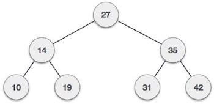

# Discussion 4

## Agenda

- Tree Traversal
- Red Black Trees

---

## Tree Traversal

- Pre-order
- In-order
- Post-order
- Level-order

---

Pre-order: **1.**"Visit" a node and then **2.** traverse the node's left subtree first and then **3.** traverse the node's right subtree.

In-order: **1.** Traverse the node's left subtree first and then **2.** "Visit" the node, then **3.** traverse the node's right subtree.

Post-order: **1.** Traverse the node's left subtree first, then **2.** traverse the node's right subtree. **3.** "Visit" the node, then traverse the node's right subtree.

Level-order: Traverse the tree in level order, layer by layer.

### Pre-order (Depth first search DFS)

```python
def preorder(tree):
     if tree is null: return
     print(tree.val)
     preorder(tree.left_subtree)
     preorder(tree.right_subtree)
```



Pre-order: 27, 14, 10, 19, 35, 31, 42

### In-order

```python
def inorder(tree):
     if tree is null: return
     inorder(tree.left_subtree)
     print(tree.val)
     inorder(tree.right_subtree)
```


In-order: 10, 14, 19, 27, 31, 35, 42

### Post-order

```python
def Postorder(tree):
     if tree is null: return
     Postorder(tree.left_subtree)
     Postorder(tree.right_subtree)
		 print(tree.val)
```


Post-order: 10, 19, 14, 31, 42, 35, 27

### level-order

Breadth First Search BFS with Queue

```python
def printLevelOrder(root):
    if root is None:
        return
    # Create an empty queue for level order traversal
    queue = []
    # Enqueue Root
    queue.append(root)
 
    while(len(queue) > 0):
        # Print head of queue and remove it from queue
        print(queue[0].data)
        node = queue.pop(0)
        # Enqueue left child
        if node.left is not None:
            queue.append(node.left)
        # Enqueue right child
        if node.right is not None:
            queue.append(node.right)
```


Level-order: 27, 14, 35, 10, 19, 31, 42

---

Q: Which traversal should we use if we want to delete all nodes in the tree? 

------


For a binary search tree, in-order traversal gives you a sorted sequence.

In-order traversal: 1, 3, 4, 6, 7, 8, 10, 13, 14

### Application

Pre-order: prefix notation of expression

In-order: on a BST retrieves the elements in sorted order. This can be useful for applications that require sorted data without additional sorting overhead.

Post-order: Deletion of Nodes. Since children are visited before the parent, it's easier to safely delete or deallocate nodes.

------

## Is this a binary search tree?


**Verifying** that all nodes on the left subtree of a node have lesser values, and all nodes on the right subtree of a node have greater values.

In-order: 2, 7, 5, 6, 11, 1, 9, 5, 9

If the list is sorted. If it's sorted, then the tree is a BST.

---

## Red Black Tree

### Recall binary search tree BST

Ideally time complexity for search an element: $O(log(n))$


If the BST is not balanced, like...


Time complexity for search an element $O(n)$

---

### Why Red Black Tree?

- **Self-balancing** binary search tree (BST) ensure that the tree remains **approximately** balanced
- **Binary Search Tree Property**

------

### AVL tree vs Red black tree

|                        | AVL tree                                                     | Red-black tree                                         |
| ---------------------- | ------------------------------------------------------------ | ------------------------------------------------------ |
| Balancing Criteria     | Strictly balanced (the height difference between the left and right subtrees of any node is limited to 1) | **approximately** balanced maintained through coloring |
| Insertion and Deletion | Require more rotations, **SLOWER**                           | Faster                                                 |
| Memory                 | Less memory cost                                             | Extra storage for color                                |

---

### Definition

1. Each node is either red or black
2. Root is black
3. Each Leaf is black(leaf is NIL node)
4. Red node only has black children (There are no two adjacent red nodes)
5. For each node, all simple paths from the node to descendent leaves contain
   the same number of black nodes.

##### Lemma

A red-black tree with **n** internal nodes has height at most $2log(n+1)$.
*(For a proof, see Cormen, p 264)*

Red-black tree search time can always be in $O(log\ n)$

------

### Insertion

1. Insert as regular binary search tree.
2. Set new node's color to Red. (Why? Rule 5)
   - If it is set to black, it will result in an extra black node on one of the paths from the root to the leaf.
3. Fix up. (Rotate and color flips)

```python
INSERT(T, n)
  y = T.NIL
  temp = T.root
	# Find the place to insert
  while temp != T.NIL
      y = temp
      if n.data < temp.data
          temp = temp.left
      else
          temp = temp.right
  n.parent = y
  if y==T.NIL
  		# If this is a empty tree
      T.root = n
  else if n.data < y.data
      y.left = n
  else
      y.right = n

  n.left = T.NIL
  n.right = T.NIL
  # Assign red to new node
  n.color = RED
  INSERT_FIXUP(T, n)
```

---

#### Color flips

- Change the color of the node.
- Rule 3: Leaf (NULL node) is always black.
- Always try recoloring first, if recolor doesn't work, then go for rotation.

The algorithms have mainly two cases depending upon the colour of the uncle. If the uncle is red, we do recolour. If the uncle is black, we do rotations and/or recolouring.

#### Rotations

**Left Rotation**

- Assume the right child is not null. y/node7 is not null.
- The node *y* will become the new root of the subtree and its left child will be *x*. And the previous left child of *y* will now become the right child of *x*.


------

**Right Rotation**

- Assume that the left child is not null.
- Right rotation on the node *y* will make *x* the root of the tree, *y* will become *x*'s right child. And the previous right child of *x* will now become the left child of *y*.


------


Note that in both trees, an in-order traversal yields:

```
A x B y C
```

After rotations BST is still BST.

---

## Algorithm to Maintain Red-Black Property After Insertion

1. Insert as regular binary search tree.
2. Set new node's color to Red.
3. Fix up. (Rotate and color flips)

**Six cases** in total. First three cases below, the other three cases will be symmetric when the node *z* will be the right child of its parent.


3 pairs of cases:

1. Parent and Uncle Red
2. Parent Red, Uncle Black, Right Child
3. Parent Red, Uncle Black, Left Child

------

#### First case - Parent and Uncle Red

- Shift the red color upward until there is no violation. 
- Otherwise, if it reaches to the root, we can just color it black without any consequences.


------

#### Second case - Parent Red, Uncle Black, Right Child

Transform the second case into the third one by performing left rotation on the parent of the node *z*.


------

#### Third case - Parent Red, Uncle Black, Left Child

1. Color the parent of the node *z* black and its grandparent red
2. Do a right rotation on the grandparent of the node *z*.


```python
INSERT_FIXUP(T, z)
  while z.parent.color == red
  		# z.parent is left child
      if z.parent == z.parent.parent.left
      		# y is Uncle
          y = z.parent.parent.right
          
					# Uncle Red
          if y.color == red # case 1 Parent and Uncle Red
              z.parent.color = black
              y.color = black
              z.parent.parent.color = red
              z = z.parent.parent
              
					# Uncle Black
          else # case 2 or 3
              if z == z.parent.right # case 2, Parent Red, Uncle Black, Right Child
                  z = z.parent # marked z.parent as new z
                  LEFT_ROTATE(T, z) # rotated parent of orignal z, convert to case 3

              # case 3, Parent Red, Uncle Black, Left Child
              z.parent.color = black # made parent black
              z.parent.parent.color = red # made grandparent red
              RIGHT_ROTATE(T, z.parent.parent) # right rotation on grandparent
			# z.parent is right child
      else 
          code will be symmetric
  # Root must be black
  T.root.color = black
```

------

### Examples


